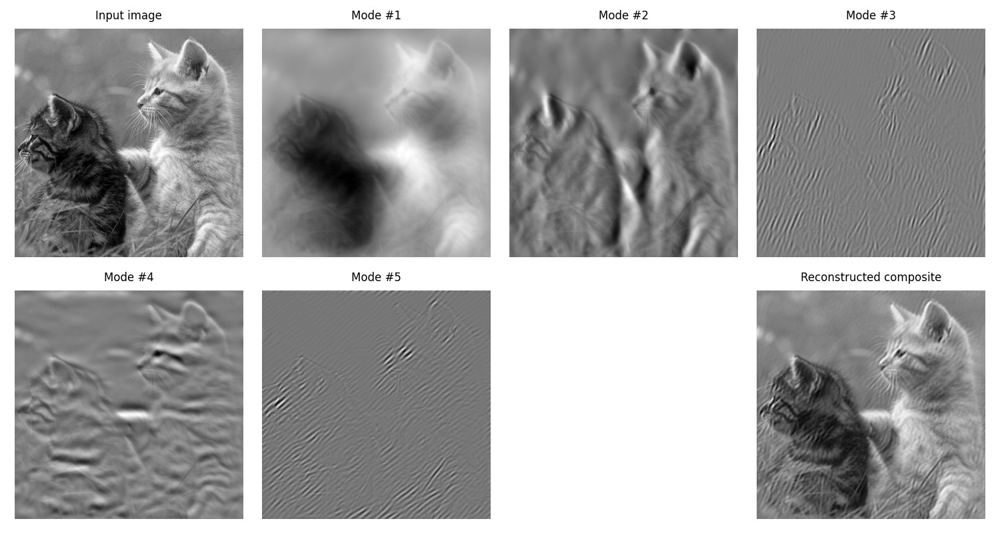

# VMD_2D_python
# Python3 implementation of 2D Variational Mode Decomposition using NumPy

Written by: Dodge(Lang HE) asdsay@gmail.com  
Updated date: 2023-11-16  
Variational Mode Decomposition for Python in 2D

**VMD**, aka Variational Mode Decomposition, is a signal processing tool that decompse the input signal into different band-limited IMFs.  
**VMD_2D**, means we are processing 2D signal (Two dimension should usually have same length). Project **VMD_2D_Python**  is an imitation of [that in MATLAB](https://uk.mathworks.com/matlabcentral/fileexchange/45918-two-dimensional-variational-mode-decomposition?s_tid=mwa_osa_a). Spectrum-based decomposition of a 2D input signal into k band-separated modes. 

-------

In this project, I used a grey picture to test. The function ***VMD2D*** only needs Numpy, but we also need OpenCV and matplotlib to read and print the picture. 

Please also pay attention to line 34-35 in *VMD2D.py* :  
`     # Maximum number of iterations` 
`     N = 3000`
  In the original Matlab code, it was a solid **3000**. However under my test, the sample pictgure does **not** converge. Luckily, for this picture, it is practically the same if I set **N = 100**. So feel free to change the **N** value.

-------

If you are looking for document to describe Variational mode decomposition, please turn to the original paper:

K. Dragomiretskiy, D. Zosso, Variational Mode Decomposition, IEEE Trans. on Signal Processing (in press)
please check here for update reference: 
http://dx.doi.org/10.1109/TSP.2013.2288675

----------------------------------------------------------------------------------------------------------------

# 二维VMD（变分模态分解）的Python3实现，使用NumPy

作者：Dodge asdsay@gmail.com 更新日期：2023-11-16

**VMD**（变分模态分解）是一种信号处理算法，可以将输入信号分解为不同带限的内禀模态函数（IMFs）。
**VMD_2D**意味着我们正在处理二维信号（通常两个维度应该长度相同）。项目是MATLAB中实现的模仿。基于频谱的二维输入信号分解为k个带分离模式。
本项目**VMD_2D_Python**是参考于[其在MATLAB中的实现](https://uk.mathworks.com/matlabcentral/fileexchange/45918-two-dimensional-variational-mode-decomposition?s_tid=mwa_osa_a)。基于频谱的二维输入信号分解为k个带分离模式。

-------

在这个项目中，我用一张灰度图片进行测试。本项目**VMD_2D_Python**仅需要Numpy，但我们还需要OpenCV和matplotlib两个库来读取和显示图片。

还请注意 *VMD2D.py*第34-35行：
`     # Maximum number of iterations` 
`     N = 3000`
在原始的Matlab代码中，N是固定值3000。然而在测试中，样本图片计算的误差没有收敛。发现对于这张图片，如果设置N = 100，实际效果几乎就收敛了。请用户更改N值测试效果。

-------

如果需要描述变分模态分解的文档，可参阅原始论文：
K. Dragomiretskiy, D. Zosso, Variational Mode Decomposition, IEEE Trans. on Signal Processing (in press)
http://dx.doi.org/10.1109/TSP.2013.2288675
